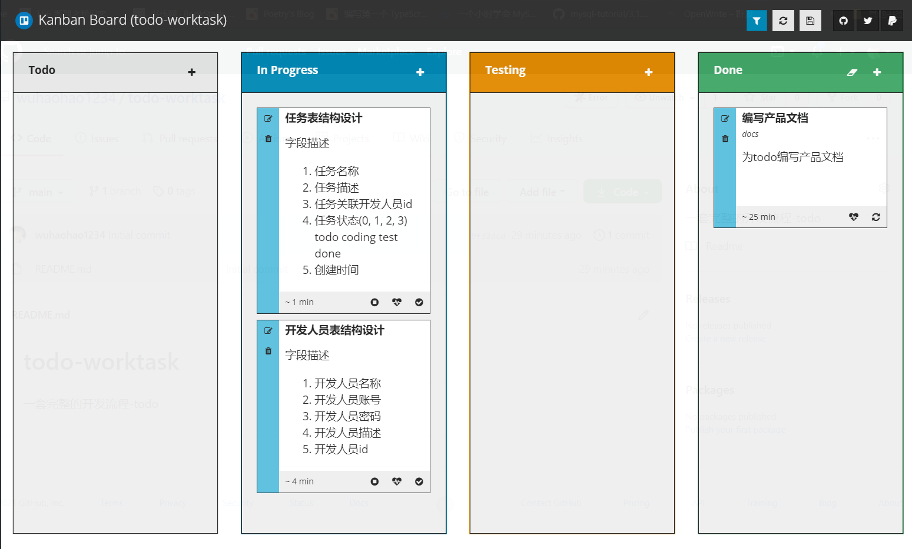

# 工作协作平台

## 克隆该项目

`git clone https://github.com/wuhaohao1234/work-collaboration-platform`

## 运行sql

## 安装依赖

进入worktask 安装前端依赖

`npm install`

进入server 安装后端依赖

`cd server & npm install`

已经配置过淘宝镜像，无需配置

## 运行项目

进入server运行后端项目

`npm run dev`

根目录运行前端项目

`npm run start`

浏览器打开http://localhost:8080/work

输入账号与密码

admin & 123456